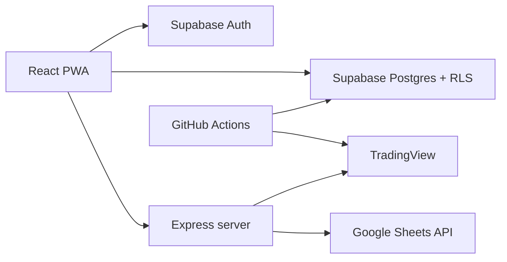

# EGX Portfolio

A private Egyptian Exchange (EGX) portfolio tracker focused on accurate trade accounting, live market prices, cash tracking, closed trade cycles, historical performance, and mobile-friendly trade logging.

The application is built with React, TypeScript, Vite, Express, Supabase, and a small number of server-side integrations for TradingView and Google Sheets.

## What the app does

- Tracks BUY and SELL transactions and derives open positions from the transaction ledger.
- Tracks fees, realized P&L, unrealized P&L, cash, capital contributions, closed trade cycles, and portfolio equity.
- Pulls current EGX market data through server-side TradingView proxy endpoints.
- Stores portfolio data in Supabase.
- Uses Supabase email/password authentication for portfolio access.
- Uses Row Level Security (RLS) to scope portfolio rows to the authenticated user.
- Stores daily EGX history plus 15-minute intraday bars for transaction-aware analytics.
- Calculates money-weighted return (MWRR) and drawdown only when sufficient historical data exists.
- Supports OCR-assisted trade entry and optional Google Sheets synchronization.
- Includes scheduled GitHub Actions for historical-price synchronization and production-data auditing.

## Tech stack

| Layer | Technology |
| --- | --- |
| UI | React 19, TypeScript, Tailwind CSS |
| Build | Vite 6 |
| Server | Express 4 |
| Database | Supabase Postgres |
| Authentication | Supabase Auth |
| Charts | Recharts |
| Market data | TradingView endpoints through the Express server |
| OCR | Tesseract.js |
| Optional spreadsheet sync | Google Sheets API |
| Tests | Vitest |
| CI | GitHub Actions |

## Quick start

### Requirements

- Node.js 22+
- npm 11+
- A Supabase project with the required tables, RLS policies, and one authenticated portfolio owner

### Install

```bash
git clone https://github.com/sherif007-noob/EGX-Portfolio.git
cd EGX-Portfolio
npm install
```

Create a local environment file with at least:

```env
VITE_SUPABASE_URL=https://YOUR_PROJECT.supabase.co
VITE_SUPABASE_PUBLISHABLE_KEY=YOUR_PUBLISHABLE_KEY

SUPABASE_URL=https://YOUR_PROJECT.supabase.co
SUPABASE_SECRET_KEY=YOUR_SERVER_SECRET_KEY
```

Never expose `SUPABASE_SECRET_KEY` in browser code or a `VITE_*` variable.

Run the application:

```bash
npm run dev
```

The Express/Vite development server listens on port 3000 by default:

```text
http://localhost:3000
```

## Core commands

```bash
npm run dev
npm run lint
npm test
npm run build
npm start
npm run sync:historical
npm run sync:intraday
npm run verify:production-data
```

Legacy Firestore migration commands are intentionally retained for one-time migration/verification only:

```bash
npm run migrate:firestore:supabase
npm run verify:firestore:supabase
```

## Architecture at a glance



The transaction ledger is the accounting source of truth. Positions, cash, and closed trade cycles are reconciled from transactions rather than treated as independent financial records.

See [docs/ARCHITECTURE.md](docs/ARCHITECTURE.md) for the full design.

## Documentation

- [Architecture](docs/ARCHITECTURE.md)
- [Development setup](docs/DEVELOPMENT.md)
- [Data model](docs/DATA_MODEL.md)
- [API reference](docs/API.md)
- [Authentication and security](docs/AUTH_AND_SECURITY.md)
- [Performance analytics](docs/PERFORMANCE_ANALYTICS.md)
- [Analytics visual system](docs/ANALYTICS_VISUAL_SYSTEM.md)
- [Intraday market data](docs/INTRADAY_MARKET_DATA.md)
- [Testing](docs/TESTING.md)
- [Operations and deployment](docs/OPERATIONS.md)
- [Troubleshooting](docs/TROUBLESHOOTING.md)
- [Contributing](CONTRIBUTING.md)
- [Security policy](SECURITY.md)
- [Changelog](CHANGELOG.md)

## Accounting rules

The project follows several important invariants:

1. The transaction ledger is authoritative.
2. A UI mutation is not considered successful until persistence succeeds.
3. Cash is derived from contributed capital plus ledger cash impacts.
4. Positions must reconcile to BUY shares minus SELL shares.
5. Closed cycles are derived from the same ledger.
6. Historical analytics must not invent missing performance or drawdown values.
7. Startup hydration is read-only; opening the app must not rewrite accounting data.
8. Financial data must never be silently deduplicated or rewritten without an explicit operation.

## Authentication

Portfolio authentication uses Supabase email/password sessions. The browser uses only the Supabase publishable key.

Firebase still exists in the repository for legacy migration utilities and the optional Google OAuth path used by Google Sheets. It is not the primary portfolio authentication system.

## CI and automation

Pull requests and pushes to `main` run:

- TypeScript typecheck
- Vitest test suite
- Production build

Scheduled workflows also:

- synchronize daily historical EGX prices Sunday through Thursday;
- ingest 15-minute EGX bars during the trading-day window;
- audit production portfolio data Sunday through Thursday.

See [docs/OPERATIONS.md](docs/OPERATIONS.md).

## Disclaimer

This software is a personal portfolio tracking and analytics tool. Market data and calculated analytics should be independently verified before being used for financial decisions.
