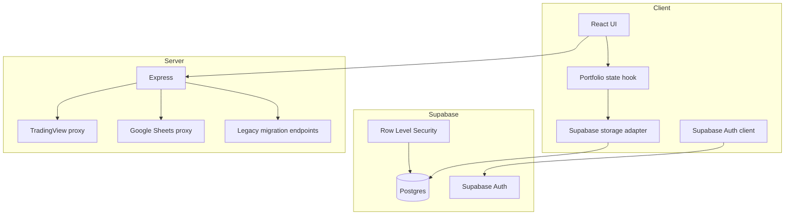
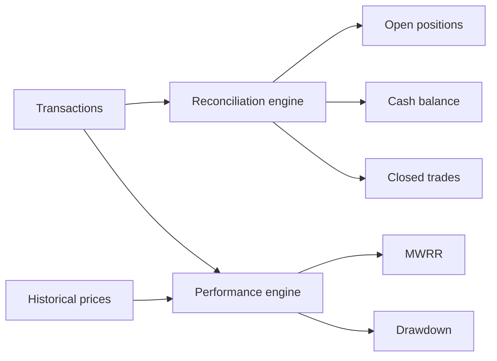

# Architecture

## Overview

EGX Portfolio is a React/TypeScript application served by an Express process. Portfolio identity and persistence are handled by Supabase. The Express server remains responsible for integrations that should not be performed directly from the browser, including TradingView proxying and Google Sheets server-side access.

## High-level design



## Client application

Entry point:

- `src/main.tsx`

The application is wrapped by `SupabaseAuthGate`, which checks the current Supabase session and displays an email/password sign-in form when no session exists.

The main portfolio state lives in:

- `src/hooks/usePortfolioState.ts`

The hook coordinates:

- positions;
- closed trades;
- transactions;
- cash;
- capital deposits;
- ticker data;
- trade mutations;
- ledger reconciliation;
- persistence.

## Persistence layers

### Browser Supabase client

`src/services/supabaseBrowser.ts` creates a browser-safe Supabase client using:

- `VITE_SUPABASE_URL`
- `VITE_SUPABASE_PUBLISHABLE_KEY`

Sessions are persisted and refreshed automatically.

### Portfolio persistence

`src/services/supabasePersistence.ts` performs authenticated reads and writes directly against Supabase.

The authenticated user is resolved with `supabase.auth.getUser()`, and the portfolio is selected using:

```text
portfolios.owner_key = auth user UUID
```

Accounting snapshot writes use the database RPC:

```text
replace_portfolio_accounting_snapshot(...)
```

This writes the portfolio accounting snapshot atomically.

### Storage compatibility layer

`src/services/supabaseStorage.ts` is the storage orchestration layer.

Some exported function names still contain the word `Firestore` for backwards compatibility with older application code, but the implementation now targets Supabase.

Important responsibilities:

- serializing writes through a queue;
- deriving canonical ledger state before persistence;
- fingerprinting snapshots to avoid unnecessary writes;
- polling for newer remote data;
- ensuring local mutation windows are not overwritten by polling;
- keeping startup hydration read-only.

## Accounting architecture

The transaction ledger is the financial source of truth.



Key services include:

- `portfolioAccounting.ts`
- `portfolioReconciliation.ts`
- `portfolioPerformance.ts`
- `performanceEngine.ts`
- `cashLedger.ts`

Derived records must reconcile back to the ledger.

## Server architecture

`server.ts` starts Express and uses Vite in middleware mode during development.

Main route groups:

- `/api/health`
- `/api/egx/*`
- `/api/tradingview/*`
- `/api/sheets/*`
- legacy `/api/supabase/*` bridge endpoints
- optional legacy migration endpoint

Normal browser portfolio persistence now talks directly to Supabase using RLS. The legacy server-side Supabase portfolio endpoints remain available but are not the primary browser persistence path.

## Market data

Current EGX data is fetched through server endpoints that proxy TradingView. This avoids browser cross-origin restrictions and keeps the market-data implementation isolated from React components.

Historical prices are stored in `price_history` and are synchronized by `scripts/syncHistoricalPrices.ts`.

## Google Sheets

Google Sheets is optional and separate from portfolio authentication.

The server can authenticate to Google using a service account. If no service account is configured, the application can fall back to a user-provided Google OAuth bearer token.

Firebase client code remains only because the existing optional Google sign-in flow still uses Firebase Auth as an OAuth helper.

## Legacy migration code

The repository contains Firestore-to-Supabase migration utilities. These are retained for one-time migration and verification and are not part of normal portfolio persistence.

Legacy code must not be mistaken for the current architecture:

```text
Current portfolio auth: Supabase Auth
Current portfolio DB:   Supabase Postgres
Legacy migration source: Firestore
Optional Google OAuth:  Firebase helper
```

## PWA

The project uses `vite-plugin-pwa`. When debugging stale front-end behavior, remember that an installed service worker can serve an older bundle even after the repository has been updated. See [TROUBLESHOOTING.md](TROUBLESHOOTING.md).
