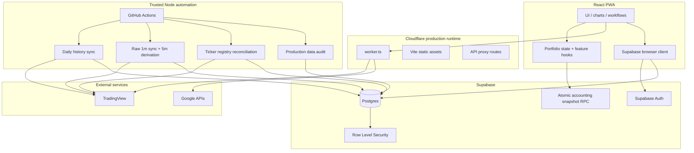
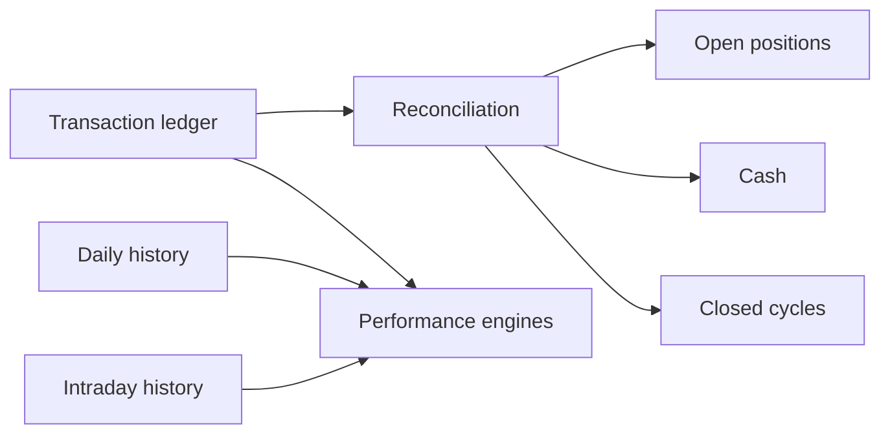

# Architecture

## Status

**Canonical current architecture for the production/default `main` branch.**

For current rollout gaps and the next implementation step, see [STATUS.md](STATUS.md). For future structural changes, see [MASTER_STABILIZATION_ROADMAP.md](MASTER_STABILIZATION_ROADMAP.md).

## System overview

EGX Portfolio has four operational layers:


```mermaid
flowchart TB
    subgraph Client["React PWA"]
      UI[UI / charts / workflows]
      STATE[Portfolio state + feature hooks]
      BROWSERDB[Supabase browser client]
    end

    subgraph Edge["Cloudflare production runtime"]
      WORKER[worker.ts]
      ASSETS[Vite static assets]
      APIPROXY[API proxy routes]
    end

    subgraph Data["Supabase"]
      AUTH[Supabase Auth]
      PG[(Postgres)]
      RLS[Row Level Security]
      RPC[Atomic accounting snapshot RPC]
    end

    subgraph Automation["Trusted Node automation"]
      GH[GitHub Actions]
      HIST[Daily history sync]
      INTRA[Raw 1m sync + 5m derivation]
      REG[Ticker registry reconciliation]
      AUDIT[Production data audit]
    end

    subgraph External["External services"]
      TV[TradingView]
      GS[Google APIs]
    end

    UI --> STATE
    UI --> WORKER
    UI --> BROWSERDB
    BROWSERDB --> AUTH
    BROWSERDB --> PG
    PG --> RLS
    STATE --> RPC
    WORKER --> TV
    WORKER --> GS
    GH --> HIST
    GH --> INTRA
    GH --> REG
    GH --> AUDIT
    HIST --> TV
    INTRA --> TV
    REG --> TV
    HIST --> PG
    INTRA --> PG
    REG --> PG
    AUDIT --> PG
```

## Runtime split

### Production

Cloudflare uses:

- `worker.ts` for `/api/*`;
- `dist/` Vite assets through the Worker assets binding;
- SPA fallback for application routes.

Configuration: `wrangler.jsonc`.

Build/deploy:

```bash
npm run build:cloudflare
npm run deploy:cloudflare
```

### Local/development

`server.ts` starts Express and Vite middleware for development and local compatibility.

```bash
npm run dev
```

The Express runtime is not the description of the currently deployed Cloudflare production topology.

## Authentication and persistence

Primary portfolio authentication is Supabase Auth.

The browser uses:

- `VITE_SUPABASE_URL`;
- `VITE_SUPABASE_PUBLISHABLE_KEY`.

Portfolio access is scoped through RLS and authenticated ownership.

The financial source of truth is the transaction ledger.

Accounting snapshot persistence uses the database RPC:

```text
replace_portfolio_accounting_snapshot(...)
```

The RPC atomically replaces the related accounting projection under portfolio ownership checks.

## Storage orchestration

`src/services/supabaseStorage.ts` is the compatibility/orchestration layer.

Some public function names still contain `Firestore` from the earlier architecture. They currently route to Supabase and are legacy names, not a second active database.

Responsibilities include:

- serialized write queue;
- ledger-derived canonical snapshot;
- snapshot fingerprinting;
- mutation window protection;
- remote polling/hydration;
- quote-only update isolation.

## Financial mutation boundary

Stage 2 established:

`src/services/ledgerMutationService.ts`

The canonical financial write path is now:

```text
workflow prepare
  → ledger mutation validation
  → portfolio reconciliation
  → forceFullSyncToFirestore
  → replace_portfolio_accounting_snapshot RPC
  → local state apply
```

The mutation boundary owns ordering and structured failures.

The database RPC already provides the atomic accounting snapshot write.

Stage 2.1 defined this architecture. Stage 2.2 routes BUY/SELL through it. Stage 2.3 now routes transaction edit/delete, cash, OCR, reconciliation and restore/import workflows through the same executor instance.

### Current BUY/SELL path

```text
Add Trade / Sell modal
  → async App handler
  → usePortfolioState
  → tradeLedgerMutations.prepare*
  → ledgerMutationService
  → portfolioReconciliation
  → forceFullSyncToFirestore
  → replace_portfolio_accounting_snapshot RPC
  → apply canonical React state
  → success UI
  → optional Google Sheets mirror
```

The App and modals therefore do not infer successful money/share state from button submission.

Position thesis metadata has separate ownership from accounting projections: position/BUY-authored target, stop and notes take precedence over ticker-directory defaults, while shares/cost/cash/P&L remain ledger-derived.

### Current broader ledger-workflow path

```text
Journal / Cash / OCR / Backup / Sheets / Reconcile
  → async workflow handler
  → workflow-specific pure prepare function
  → shared ledgerMutationService executor
  → portfolioReconciliation
  → atomic Supabase accounting snapshot RPC
  → apply canonical React state
  → success UI / optional integration mirror
```

Key preparation modules:

- `tradeLedgerMutations.ts` — BUY/SELL;
- `ledgerWorkflowMutations.ts` — transaction correction, cash, reconciliation, restore/import;
- `ocrLedgerMutations.ts` — dependency-aware batch import;
- `cashLedger.ts` — cash-ledger construction/capital helpers.

The executor is intentionally shared. A cash edit cannot race a BUY, an OCR batch cannot race a transaction delete, and restore cannot race a SELL through separate workflow-specific locks.

Backup and Google Sheets imports do not trust imported positions/closed cycles/cash as independent accounting sources. Their transaction ledger is reconciled into one canonical snapshot before persistence.

### Derived-record ownership — Stage 2.4 closed

Position and Closed Cycle are now projection/navigation surfaces, not independent accounting records.

Their correction path is:

```text
derived Position / Closed Cycle
  → resolve source execution IDs
  → scoped Transaction Journal
  → explicit source transaction edit/delete
  → shared ledger mutation executor
  → reconciliation rebuild
```

`ledgerProjectionOwnership.ts` owns active-position correction scoping.

It tracks aggregate running shares and active-cycle boundaries. It does not allocate remaining ownership through FIFO lots.

Closed Cycles prefer their persisted `buyTransactionIds` / `sellTransactionIds` source links.

The old FIFO deletion helper, Position delete mutation and local Closed Cycle delete action have been removed.

### Trade cash-effect ownership — Stage 2.5 closed

BUY/SELL no longer exposes a compatibility mode that can suppress broker-cash movement.

```text
Add Trade
  → required BUY cash debit
  → canonical ledger row

Sell Position
  → required SELL cash credit
  → canonical ledger row
```

The UI may preview the cash effect, but it does not decide whether the effect exists.

That rule is encoded in `tradeLedgerMutations.ts` and the resulting transaction's `netCashImpact`.

BUY pre-validation and canonical mutation preparation now enforce the same insufficient-cash rule.

Cash reconciliation remains a separate ledger workflow; it is not a trade option.

Stage 4 completed the main repository/mutation/presentation ownership separation without rewriting accounting behavior. Later cleanup may refine module size, but the accepted boundaries remain authoritative.

## Accounting model


```mermaid
flowchart LR
    TX[Transaction ledger] --> REC[Reconciliation]
    REC --> POS[Open positions]
    REC --> CASH[Cash]
    REC --> CLOSED[Closed cycles]
    TX --> PERF[Performance engines]
    DAILY[Daily history] --> PERF
    INTRA[Intraday history] --> PERF
```

Key services:

- `portfolioAccounting.ts`;
- `portfolioReconciliation.ts`;
- `cashLedger.ts`;
- `portfolioPerformance.ts`;
- `unifiedAnalyticsEngine.ts`;
- `intradayAnalyticsEngine.ts`;
- `secondaryAnalytics.ts`.

The canonical persist-before-apply mutation boundary is fully adopted across BUY/SELL, transaction edits/deletes, cash, OCR, restore/import, reconciliation and BONUS_SHARES corporate actions. Stage 2 is closed; derived Position/Closed Cycle accounting mutations are not independent write paths.

## Corporate actions

Corporate actions are canonical transaction-ledger events and use the same persist-before-apply executor as other financial mutations.

Current implemented action:

- `CORPORATE_ACTION / BONUS_SHARES`.

The action has zero cash impact and zero added cost, increases share quantity, and preserves total cost basis. Entitlement is derived from the ledger immediately before the effective date, and the saved source-share count acts as a stale-ledger guard.

See [CORPORATE_ACTIONS_LEDGER.md](CORPORATE_ACTIONS_LEDGER.md). Stage 6.3 owns expansion to the remaining corporate-action lifecycle.

## Reports workspace

Reports is a feature-owned analytical workspace with five internal modes:

- Overview;
- Analytics;
- Trading;
- Allocation;
- Monthly.

The selected mode is remembered via `reports:lastMode`. Overview is diagnostic and uses progressive disclosure; full report modes reuse the canonical accounting/analytics engines rather than recalculating financial truth.

See [POST_OVERHAUL_REPORTS_WORKSPACE_REDESIGN_PLAN.md](POST_OVERHAUL_REPORTS_WORKSPACE_REDESIGN_PLAN.md).

## Market data

### Live/current quote path

TradingView Egypt Scanner is proxied through the application API.

Current quote handling includes timestamp/freshness rules so an older remote read should not overwrite a newer accepted quote.

### Daily history

Table:

```text
price_history
```

Trusted Node sync:

```text
scripts/syncHistoricalPrices.ts
```

### Intraday history

Table:

```text
intraday_price_history
```

Current policy:

- raw 1m TradingView observations;
- derived 5m from persisted raw observations;
- legacy 15m fallback;
- UTC storage;
- Cairo session interpretation;
- no fabricated missing candles.

See [INTRADAY_MARKET_DATA.md](INTRADAY_MARKET_DATA.md).

## Ticker identity

Security identity is separated from quote snapshots.

Authoritative service-managed tables:

- `ticker_registry`;
- `ticker_aliases`.

The quote/technical snapshot table remains separate.

Resolution supports current ticker, persisted history symbol, legacy aliases and ISIN fallback according to the documented precedence.

See [TICKER_REGISTRY.md](TICKER_REGISTRY.md).

## Cloudflare API responsibilities

Current Worker route families include:

- `/api/health`;
- authenticated Supabase portfolio/price/history compatibility routes;
- `/api/egx/scan`;
- `/api/tradingview/symbol-search`;
- Google Sheets OAuth-bearer proxy routes.

Historical repair/ingestion is intentionally **not** performed inside the Worker. Node automation owns market-history writes.

The old intraday-history ensure route is a compatibility no-op for stale PWA clients.

## Google Sheets

Google Sheets is optional and separate from portfolio authentication.

In Cloudflare production, Sheets requests use the user's Google OAuth bearer flow.

Local/Node compatibility may additionally support service-account behavior.

Firebase code remains only for legacy migration and the optional Google OAuth helper; it is not the portfolio authentication/database architecture.

## Scanner/alerts

Price alerts and the current sector-momentum detector are client features.

The sector detector currently executes from React during an active market session and stores short-lived history/dedup state in localStorage.

It is therefore not a true background detector. Future server-side operationalization is explicitly deferred in the master roadmap.

## PWA

The application uses `vite-plugin-pwa`.

A stale service worker can make a device appear to run older code after deployment. Use the documented troubleshooting path before assuming persisted portfolio data differs.

## Current structural state

Stage 4 architecture consolidation is closed.

Current accepted ownership includes:

- domain accounting/performance/market facades;
- Supabase data boundary;
- integration boundaries for Google Sheets, OCR and TradingView;
- portfolio/report feature ownership;
- shared Worker/Express request contracts;
- stable CSS ownership entry and layered shared/feature owners.

No rewrite is planned. Future Stage 10 cleanup may reduce legacy names or large-module residue, but must preserve the accepted financial, data, API and visual contracts.

See Stage 4 closure in [MASTER_STABILIZATION_ROADMAP.md](MASTER_STABILIZATION_ROADMAP.md).
