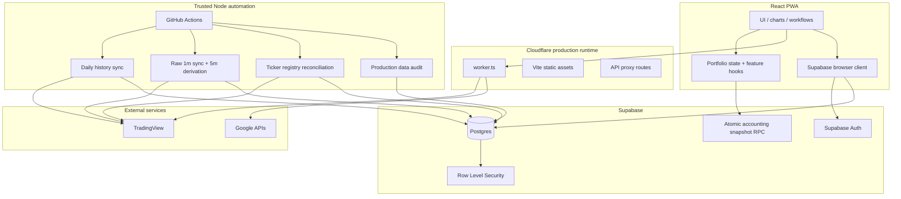
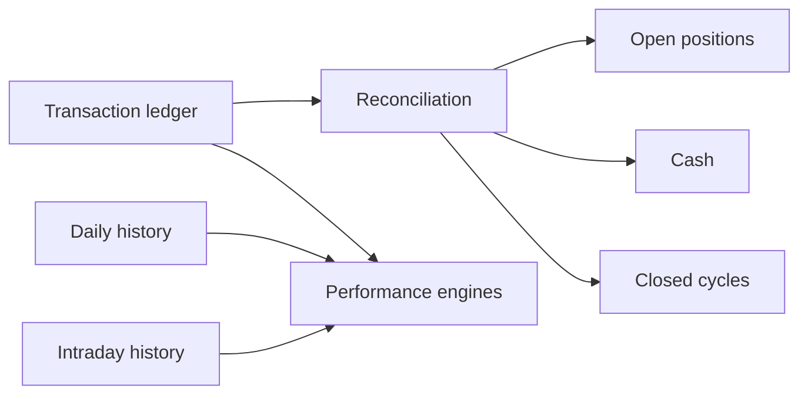

# Architecture

## Status

**Canonical current architecture for the Premium branch.**

For current rollout gaps and the next implementation step, see [STATUS.md](STATUS.md). For future structural changes, see [MASTER_STABILIZATION_ROADMAP.md](MASTER_STABILIZATION_ROADMAP.md).

## System overview

EGX Portfolio has four operational layers:


```mermaid
flowchart TB
    subgraph Client["React PWA"]
      UI[UI / charts / workflows]
      STATE[Portfolio state + feature hooks]
      BROWSERDB[Supabase browser client]
    end

    subgraph Edge["Cloudflare production runtime"]
      WORKER[worker.ts]
      ASSETS[Vite static assets]
      APIPROXY[API proxy routes]
    end

    subgraph Data["Supabase"]
      AUTH[Supabase Auth]
      PG[(Postgres)]
      RLS[Row Level Security]
      RPC[Atomic accounting snapshot RPC]
    end

    subgraph Automation["Trusted Node automation"]
      GH[GitHub Actions]
      HIST[Daily history sync]
      INTRA[Raw 1m sync + 5m derivation]
      REG[Ticker registry reconciliation]
      AUDIT[Production data audit]
    end

    subgraph External["External services"]
      TV[TradingView]
      GS[Google APIs]
    end

    UI --> STATE
    UI --> WORKER
    UI --> BROWSERDB
    BROWSERDB --> AUTH
    BROWSERDB --> PG
    PG --> RLS
    STATE --> RPC
    WORKER --> TV
    WORKER --> GS
    GH --> HIST
    GH --> INTRA
    GH --> REG
    GH --> AUDIT
    HIST --> TV
    INTRA --> TV
    REG --> TV
    HIST --> PG
    INTRA --> PG
    REG --> PG
    AUDIT --> PG
```

## Runtime split

### Production

Cloudflare uses:

- `worker.ts` for `/api/*`;
- `dist/` Vite assets through the Worker assets binding;
- SPA fallback for application routes.

Configuration: `wrangler.jsonc`.

Build/deploy:

```bash
npm run build:cloudflare
npm run deploy:cloudflare
```

### Local/development

`server.ts` starts Express and Vite middleware for development and local compatibility.

```bash
npm run dev
```

The Express runtime is not the description of the currently deployed Cloudflare production topology.

## Authentication and persistence

Primary portfolio authentication is Supabase Auth.

The browser uses:

- `VITE_SUPABASE_URL`;
- `VITE_SUPABASE_PUBLISHABLE_KEY`.

Portfolio access is scoped through RLS and authenticated ownership.

The financial source of truth is the transaction ledger.

Accounting snapshot persistence uses the database RPC:

```text
replace_portfolio_accounting_snapshot(...)
```

The RPC atomically replaces the related accounting projection under portfolio ownership checks.

## Storage orchestration

`src/services/supabaseStorage.ts` is the compatibility/orchestration layer.

Some public function names still contain `Firestore` from the earlier architecture. They currently route to Supabase and are legacy names, not a second active database.

Responsibilities include:

- serialized write queue;
- ledger-derived canonical snapshot;
- snapshot fingerprinting;
- mutation window protection;
- remote polling/hydration;
- quote-only update isolation.

A future architecture pass will separate repository, mutation and presentation responsibilities without rewriting accounting behavior.

## Accounting model


```mermaid
flowchart LR
    TX[Transaction ledger] --> REC[Reconciliation]
    REC --> POS[Open positions]
    REC --> CASH[Cash]
    REC --> CLOSED[Closed cycles]
    TX --> PERF[Performance engines]
    DAILY[Daily history] --> PERF
    INTRA[Intraday history] --> PERF
```

Key services:

- `portfolioAccounting.ts`;
- `portfolioReconciliation.ts`;
- `cashLedger.ts`;
- `portfolioPerformance.ts`;
- `unifiedAnalyticsEngine.ts`;
- `intradayAnalyticsEngine.ts`;
- `secondaryAnalytics.ts`.

Known integrity work still pending is documented in the master roadmap, especially persistence-confirmed mutation ordering and removal of direct Position accounting deletion.

## Market data

### Live/current quote path

TradingView Egypt Scanner is proxied through the application API.

Current quote handling includes timestamp/freshness rules so an older remote read should not overwrite a newer accepted quote.

### Daily history

Table:

```text
price_history
```

Trusted Node sync:

```text
scripts/syncHistoricalPrices.ts
```

### Intraday history

Table:

```text
intraday_price_history
```

Current policy:

- raw 1m TradingView observations;
- derived 5m from persisted raw observations;
- legacy 15m fallback;
- UTC storage;
- Cairo session interpretation;
- no fabricated missing candles.

See [INTRADAY_MARKET_DATA.md](INTRADAY_MARKET_DATA.md).

## Ticker identity

Security identity is separated from quote snapshots.

Authoritative service-managed tables:

- `ticker_registry`;
- `ticker_aliases`.

The quote/technical snapshot table remains separate.

Resolution supports current ticker, persisted history symbol, legacy aliases and ISIN fallback according to the documented precedence.

See [TICKER_REGISTRY.md](TICKER_REGISTRY.md).

## Cloudflare API responsibilities

Current Worker route families include:

- `/api/health`;
- authenticated Supabase portfolio/price/history compatibility routes;
- `/api/egx/scan`;
- `/api/tradingview/symbol-search`;
- Google Sheets OAuth-bearer proxy routes.

Historical repair/ingestion is intentionally **not** performed inside the Worker. Node automation owns market-history writes.

The old intraday-history ensure route is a compatibility no-op for stale PWA clients.

## Google Sheets

Google Sheets is optional and separate from portfolio authentication.

In Cloudflare production, Sheets requests use the user's Google OAuth bearer flow.

Local/Node compatibility may additionally support service-account behavior.

Firebase code remains only for legacy migration and the optional Google OAuth helper; it is not the portfolio authentication/database architecture.

## Scanner/alerts

Price alerts and the current sector-momentum detector are client features.

The sector detector currently executes from React during an active market session and stores short-lived history/dedup state in localStorage.

It is therefore not a true background detector. Future server-side operationalization is explicitly deferred in the master roadmap.

## PWA

The application uses `vite-plugin-pwa`.

A stale service worker can make a device appear to run older code after deployment. Use the documented troubleshooting path before assuming persisted portfolio data differs.

## Target structural direction

No rewrite is planned.

After visual, financial and production stabilization, architecture will move incrementally toward:

- domain accounting/performance/market modules;
- explicit Supabase repository layer;
- canonical ledger mutation service;
- feature-owned UI modules;
- shared Worker/Express request contracts;
- layered visual CSS ownership.

See Stage 4 in [MASTER_STABILIZATION_ROADMAP.md](MASTER_STABILIZATION_ROADMAP.md).
