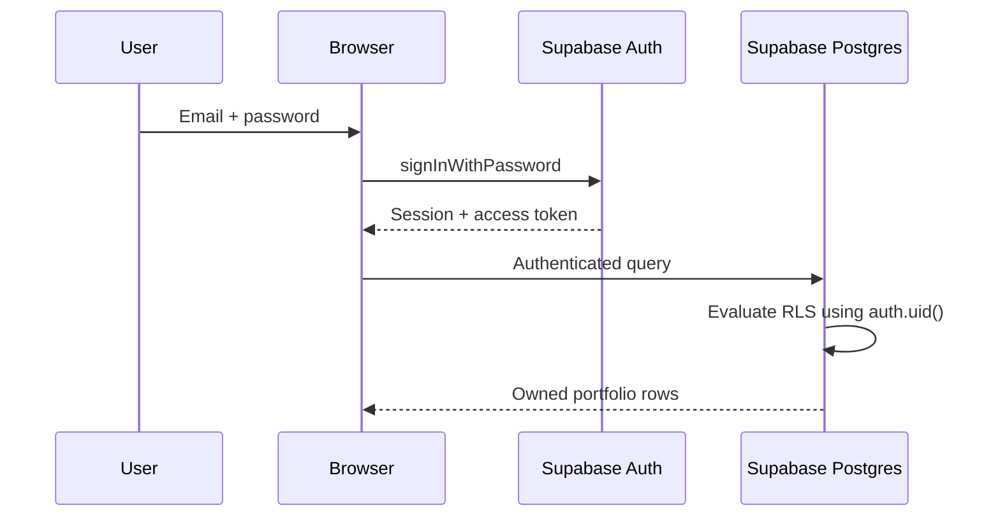

# Authentication and Security

## Current authentication model

Portfolio access uses Supabase Auth with email/password.



The browser session is persisted and automatically refreshed by `@supabase/supabase-js`.

## Browser configuration

Allowed browser variables:

```env
VITE_SUPABASE_URL=...
VITE_SUPABASE_PUBLISHABLE_KEY=...
```

A Supabase publishable key is intended for browser distribution. Access control comes from authentication and RLS.

Never put the following into browser-visible variables:

- `SUPABASE_SECRET_KEY`
- service-role keys
- Firebase Admin private keys
- Google service-account private keys

## Portfolio ownership

`portfolios.owner_key` stores the authenticated Supabase user UUID as text.

The portfolio RLS policy is conceptually:

```sql
owner_key = auth.uid()::text
```

Child tables restrict access through the owning portfolio.

Examples:

- `transactions.portfolio_id`
- `positions.portfolio_id`
- `closed_trades.portfolio_id`
- `cash_transactions.portfolio_id`
- `daily_valuations.portfolio_id`

## RLS model

Portfolio-owned tables use ownership predicates for both visibility and writes.

For write policies, both the existing row and proposed row must remain within the authenticated user's portfolio.

This is critical: `TO authenticated` by itself is not sufficient authorization.

## Market reference tables

`tickers` and `price_history` are global market-data tables rather than user-owned portfolio rows.

The current project permits authenticated access to these tables. Any future multi-user deployment should review whether authenticated users should be able to write global market data directly or whether writes should be restricted to trusted server/automation roles.

## Atomic accounting writes

The browser calls the Postgres RPC:

```text
replace_portfolio_accounting_snapshot
```

The function runs as security invoker and checks portfolio ownership through the supplied portfolio/owner pair plus normal database privileges/RLS.

It replaces the accounting snapshot as one coherent operation.

## Server-side Supabase access

Server utilities use:

```env
SUPABASE_URL=...
SUPABASE_SECRET_KEY=sb_secret_...
```

The secret key must be used only in trusted server or automation environments.

The retained Express compatibility endpoints validate the user's access token before performing user-scoped operations.

## Google Sheets authentication

Google Sheets is separate from portfolio authentication.

Preferred mode:

- server-side Google service account.

Fallback mode:

- Google OAuth bearer token from the browser.

Firebase code is still present to support the current Google sign-in helper and legacy migration utilities. Firebase is not the primary portfolio identity provider.

## Migration credentials

The Firestore migration utilities require Firebase Admin credentials and a Supabase server secret.

These variables grant powerful access and should be:

- stored only in secret managers/local secure environment files;
- removed when no longer needed;
- never committed;
- never copied into screenshots or issue reports.

## Internal RLS event trigger

The production project contains `public.rls_auto_enable()`, a `SECURITY DEFINER` event-trigger function used by the database-level `ensure_rls` DDL event trigger to automatically enable RLS on newly created `public` tables.

It is an internal database function, not a browser RPC. Production permissions explicitly revoke `EXECUTE` from:

- `PUBLIC`;
- `anon`;
- `authenticated`.

The event trigger continues to function after those revocations. This removes direct API-role execution without disabling automatic RLS enforcement.

## Current security hardening notes

When operating this project:

1. keep RLS enabled on every exposed portfolio table;
2. use ownership predicates, not role-only policies;
3. keep server secret keys server-side;
4. keep the Firestore migration endpoint disabled;
5. treat portfolio mutations as successful only after persistence succeeds;
6. audit SECURITY DEFINER functions and revoke public execute where unnecessary;
7. enable Supabase leaked-password protection when available for the project;
8. review global ticker/price-history write permissions before adding additional users.

## Reporting vulnerabilities

See the root [SECURITY.md](../SECURITY.md).
